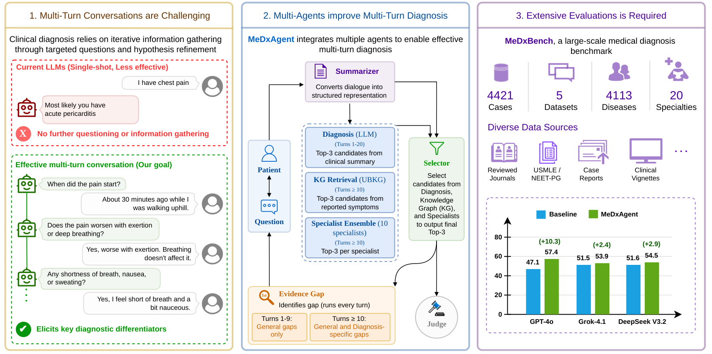

# MeDxAgent: Multi-Agent Consultation for Interactive Medical Diagnosis

<p align="center">
  
</p>

<p align="center">
  <a href="https://arxiv.org/abs/2606.03416"></a>
  
</p>

This repo contains the code, configs, and evaluation pipeline for the paper **["MeDxAgent: Multi-Agent Consultation for Interactive Medical Diagnosis"](https://arxiv.org/abs/2606.03416)**. See the paper for the system design, MeDxBench construction, results, and analysis.

This README covers what is needed to **reproduce the results** and **extend the system**.

---

## Contents

1. [Overview](#overview)
2. [Installation](#installation)
3. [Running the system](#running-the-system)
4. [Configuration](#configuration)
5. [Dataset](#dataset)
6. [Input / output format](#input--output-format)
7. [Variants and configs](#variants-and-configs)
8. [Project structure](#project-structure)
9. [Extending the system](#extending-the-system)
10. [Citation](#citation)

---

## Overview

Large language models are increasingly used for health-related decision support, but most evaluations treat diagnosis as a single-shot, multiple-choice task with the full case handed to the model upfront. In clinical practice, however, diagnosis is **interactive and open-ended**, with the physician refining a small set of working hypotheses through targeted questioning.

This repo packages two contributions from that line of work:

- **MeDxBench** : A benchmark of **4,421 clinical cases** spanning **20 specialties**, assembled from five public medical datasets and rewritten into an open-ended, vignette-only format (no answer choices). A single file: [data/input/medxbench.json](data/input/medxbench.json).
- **MeDxAgent** : A multi-agent consultation system for interactive diagnosis. A doctor agent asks one question per turn, a simulated patient agent answers from the vignette, a knowledge-graph agent retrieves UMLS candidates, a summarizer condenses the dialogue, and a diagnosis agent commits to a prediction. A judge agent grades the final answer against the ground truth. All agents live under [src/agents/](src/agents/) and are orchestrated by [src/workflows/workflow_engine.py](src/workflows/workflow_engine.py) according to a variant YAML.

On MeDxBench, MeDxAgent achieves a **10.3% accuracy gain** over a single-agent baseline and **closes 52.3% of the gap to a full-information oracle**. The paper isolates three design choices that drive most of the gain: *collecting demographics first*, *passing a summarized dialogue to the diagnosis step*, and *feeding current candidate diagnoses back into the next question*. Other components show limited benefit in isolation, with their impact emerging mainly in combination with other system components. Each component is exposed as an ablation here:

| Track | Folder | What it varies |
|---|---|---|
| `1_prompt/` | [configs/variations/1_prompt/](configs/variations/1_prompt/) | Prompt-level changes (e.g. turn awareness, demographics-first) |
| `2_flow/`   | [configs/variations/2_flow/](configs/variations/2_flow/)     | Flow-level changes (early stopping, differential-question turns) |
| `3_agent/`  | [configs/variations/3_agent/](configs/variations/3_agent/)   | Agent additions (summarizer variants, specialist ensemble, KG, evidence gap) |
| Full system | [configs/variations/medxagent.yaml](configs/variations/medxagent.yaml) | All three combined |

Every row of the paper's results table maps to a YAML in [configs/variations/](configs/variations/). See the [Variants and configs](#variants-and-configs) table for the full mapping.

---

## Installation

```bash
git clone https://github.com/microsoft/MeDxAgent
cd PreConsultationBot

python3 -m venv venv
source venv/bin/activate          # macOS/Linux
# venv\Scripts\activate           # Windows

pip install -r requirements.txt
cp .env.example .env              # then edit .env
```

---

## Running the system

The entry point is [src/main.py](src/main.py). The `-w` flag selects a variant YAML from [configs/variations/](configs/variations/).

```bash
# Run MeDxAgent (the full system) on all five MeDxBench datasets
python -m src.main \
  -i data/input/medxbench.json \
  -w configs/variations/medxagent.yaml \
  -o data/output/results_medxagent.json \
  --datasets all
```

## Configuration

The system supports four LLM providers: `openai`, `gemini`, `grok`, and `deepseek`. Per-provider model options:

| Provider | Models |
|---|---|
| `openai`   | `gpt-4o` (default), `o4-mini` |
| `gemini`   | `gemini-2.5-pro` |
| `grok`     | `grok-4-1-fast-non-reasoning` |
| `deepseek` | `Deepseek-V3.2` |

See [.env.example](.env.example) for the full list of environment variables.

```env
LLM_PROVIDER=openai
LLM_MODEL=gpt-4o
OPENAI_API_KEY=...
```

> **Note:** Azure AI Foundry is **not** supported. Its Responsible AI content filter blocks medical-domain prompts, causing failures at runtime.

Each variant YAML may also declare an `agent_models:` block to pin specific agents to specific models. See e.g. [configs/variations/medxagent.yaml](configs/variations/medxagent.yaml).

---

**Flags**

| Flag | Description |
|---|---|
| `-i, --input` | Path to the patient-cases JSON (use `data/input/medxbench.json` for MeDxBench). |
| `-w, --workflow` | Path to the variant YAML (see [Variants and configs](#variants-and-configs)). |
| `-o, --output` | Path to write the results JSON. Results are flushed after every case. |
| `-r, --case-range` | Run a subset of cases by index, e.g. `0-500`. |
| `--datasets` | Restrict to source datasets (e.g. `pubmed medmcqa`), or `all` for the full benchmark. |

---

## Dataset

**MeDxBench** is provided as a single file: `data/input/medxbench.json` (4,421 cases across 5 sources and 20 specialties). Includes cases from CRAFT-MD, DiagnosisArena, MedMCQA, MedQA and PubMed. See the paper for construction details, statistics, and leakage prevention.

---

## Input / output format

**Input** : A JSON list of cases. Required fields are `case_id`, `case_vignette`, and `gt_diagnosis` (a list, since some sources have multiple acceptable answers); the rest are MeDxBench metadata used for per-source slicing.

```json
[
  {
    "global_case_num": 1,
    "dataset_name": "craftmd_derma",
    "case_id": "craftmd_derma_case_0",
    "case_vignette": "A 22-year-old man presented with painful lesions ...",
    "gt_diagnosis": ["Lymphogranuloma venereum"],
    "category": "Infectious Disease"
  }
]
```

**Output** : A single JSON file per run containing run metadata, an aggregate `summary` (counts + accuracy + avg confidence/rounds + time-per-case), per-source `dataset_accuracies`, and one entry per case under `results` with the predicted disease, dialog history, and judge explanation. The file is rewritten after every case, so partial runs are recoverable with `--resume`. Output files live in [data/output/](data/output/).

---

## Variants and configs

Variant YAMLs are organised by ablation category under [configs/variations/](configs/variations/):

```
configs/variations/
├── medxagent.yaml                 ← the full system
├── 1_prompt/                        ← prompt-only ablations
├── 2_flow/                          ← flow ablations on the best prompt
└── 3_agent/                         ← agent additions on the best flow
```

To reproduce any row of the paper's results, run with the corresponding YAML:

| # | Variant (paper name) | Config |
|:-:|---|---|
| 1 | Baseline                  | [1_prompt/v_p0.yaml](configs/variations/1_prompt/v_p0.yaml) |
| 2 | Turn Awareness            | [1_prompt/v_p1.yaml](configs/variations/1_prompt/v_p1.yaml) |
| 3 | Demographics First        | [1_prompt/v_p2.yaml](configs/variations/1_prompt/v_p2.yaml) |
| 4 | Combined Prompt           | [1_prompt/v_p12.yaml](configs/variations/1_prompt/v_p12.yaml) |
| 5 | F1 - No Early Stopping    | [2_flow/v_p12_f1.yaml](configs/variations/2_flow/v_p12_f1.yaml) |
| 6 | F2 - Differential Q (Turn 2)   | [2_flow/v_p12_f2_turn2.yaml](configs/variations/2_flow/v_p12_f2_turn2.yaml) |
| 7 | F2 - Differential Q (Turn 5)   | [2_flow/v_p12_f2_turn5.yaml](configs/variations/2_flow/v_p12_f2_turn5.yaml) |
| 8 | F2 - Differential Q (Turn 10)  | [2_flow/v_p12_f2_turn10.yaml](configs/variations/2_flow/v_p12_f2_turn10.yaml) |
| 9 | F12 - F1 + F2 (Turn 10)        | [2_flow/v_p12_f12_turn10.yaml](configs/variations/2_flow/v_p12_f12_turn10.yaml) |
| 10 | A1a - Paragraph Summary   | [3_agent/v_p12_f2_turn10_A1a.yaml](configs/variations/3_agent/v_p12_f2_turn10_A1a.yaml) |
| 11 | A1b - Structured Summary  | [3_agent/v_p12_f2_turn10_A1b.yaml](configs/variations/3_agent/v_p12_f2_turn10_A1b.yaml) |
| 12 | A2 - Specialist Ensemble  | [3_agent/v_p12_f2_turn10_A2.yaml](configs/variations/3_agent/v_p12_f2_turn10_A2.yaml) |
| 13 | A3 - Knowledge Graph      | [3_agent/v_p12_f2_turn10_A3.yaml](configs/variations/3_agent/v_p12_f2_turn10_A3.yaml) |
| 14 | A4 - Evidence Gap         | [3_agent/v_p12_f2_turn10_A4.yaml](configs/variations/3_agent/v_p12_f2_turn10_A4.yaml) |
| 15 | **MeDxAgent** (full system) | [medxagent.yaml](configs/variations/medxagent.yaml) |

---

## Project structure

```
PreConsultationBot/
├── src/
│   ├── main.py                          # CLI entry point
│   ├── helper.py                        # CLI plumbing, output building, stats
│   ├── agents/                          # All agent implementations
│   ├── workflows/
│   │   ├── workflow_engine.py           # Orchestrates agents per variant YAML
│   │   └── workflow_context.py          # Shared per-case state passed between agents
│   ├── knowledge_graphs/                # UMLS retrieval
│   ├── llm/                             # LLM client abstraction (openai/gemini/grok/deepseek)
│   ├── models/                          # Pydantic data models
│   └── config/                          # Settings loader (.env)
├── configs/
│   ├── variations/                      # Variant YAMLs (one per row in the table above)
│   └── prompts/prompts.json             # All agent prompts
├── data/
│   ├── input/medxbench.json             # The benchmark
│   └── output/                          # Results JSONs (created on first run)
├── requirements.txt
└── .env.example
```

---

## Extending the system

### Add a new agent

1. Implement it in [src/agents/](src/agents/) as a `BaseAgent` subclass. Don't override `system_prompt`, set `agent_name` to a dotted `"category.variant"` key and the base class will load the matching prompt from [configs/prompts/prompts.json](configs/prompts/prompts.json) for you.

   ```python
   from src.agents.base_agent import BaseAgent, AgentOutput

   class MyNewAgentOutput(AgentOutput):
       diagnosis: str = ""

       # Add typed fields you want downstream agents to consume

   class MyNewAgent(BaseAgent):
       agent_name = "diagnosis.my_new"          # → prompts.json["diagnosis"]["my_new"]

       async def execute(self, context, **kwargs) -> MyNewAgentOutput:
           ...
   ```

2. Register it in [src/agents/\_\_init\_\_.py](src/agents/__init__.py) (one import line + one registry entry). The registry key is what variant YAMLs reference in their `agents:` list:

   ```python
   from .my_new_agent import MyNewAgent
   ...
   AGENT_REGISTRY["my_new_agent"] = MyNewAgent
   ```

3. Add the prompt block to [configs/prompts/prompts.json](configs/prompts/prompts.json) under the **nested key matching `agent_name`** - e.g. for `agent_name = "diagnosis.my_new"`, add `prompts.json["diagnosis"]["my_new"]` with at minimum a `system_prompt` field (and a `user_prompt_template` if `execute()` calls `self.get_user_prompt(...)`).

### Add a new variant

1. Copy an existing YAML in [configs/variations/](configs/variations/) and edit the `agents:` list and any feature flags. Each name in `agents:` must exist in `AGENT_REGISTRY`.
2. If new orchestration logic is needed (not just a new agent slotted into an existing flow), pick a new `workflow_type:` value in the YAML, add a branch for it in [src/workflows/workflow_engine.py](src/workflows/workflow_engine.py) (next to `dialog_only` / `differential_diagnosis` / etc.), and implement the corresponding `_run_<type>_workflow` method.

---

## Citation

```bibtex
@article{sanghvi2026medxagent,
  title   = {MeDxAgent: Multi-Agent Consultation for Interactive Medical Diagnosis},
  author  = {Sanghvi, Akshat and Akash, Naren and Imam, Raza and Sharma, Amit and Jain, Mohit},
  journal = {arXiv preprint arXiv:2606.03416},
  year    = {2026},
  url     = {https://arxiv.org/abs/2606.03416}
}
```
